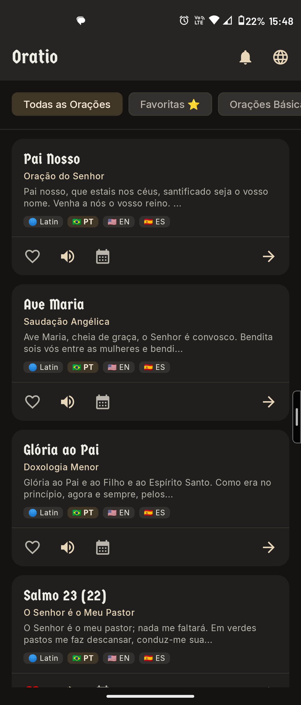
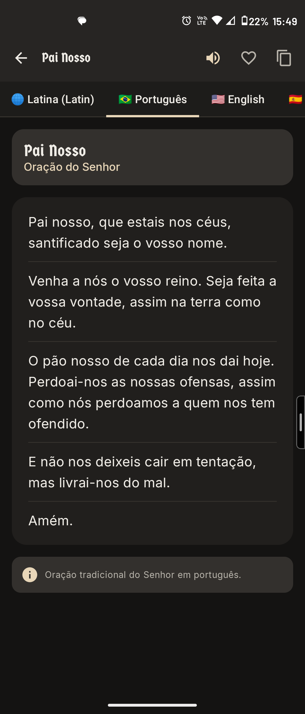
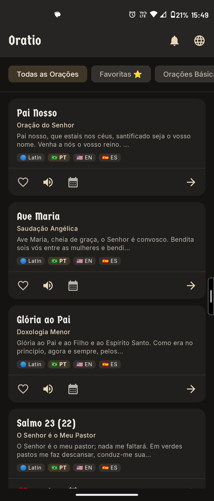
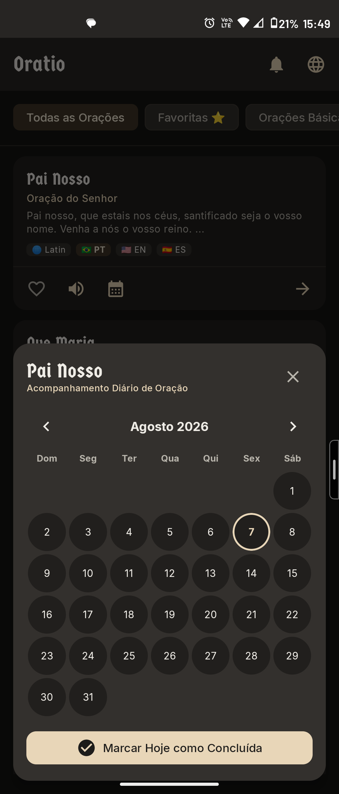

# Oratio 🕊️

**Oratio** is an Android application built with **Kotlin** and **Jetpack Compose**, designed to organize and present prayers and devotions in multiple languages (Latin, Portuguese, English, and Spanish) with **100% offline-first capability**, audio narration, prayer reminders, and habit tracking.

---

## 📱 Screenshots

<div align="center">
  
  
  
  
</div>

---

## ✨ Main Features

- 🌐 **Multilingual Support:** Traditional prayers in **Latin** (`la`), **Portuguese** (`pt`), **English** (`en`), and **Spanish** (`es`).
- 📖 **Parallel Bilingual Mode:** View original Latin texts alongside translations side-by-side in real time.
- 🔊 **Audio Narration Engine:** Embedded studio audio assets with automatic fallback to male-pitched Text-To-Speech (TTS).
- ⏰ **Prayer Alarms & Reminders:** Set exact local alarm notifications with custom day frequencies via `AlarmManager`.
- 📅 **Prayer Habit Calendar:** Track daily prayer completion with an interactive calendar overlay.
- 💾 **Offline-First DataStore & Room DB:** SQLite database managed via **Room Database** and **Jetpack DataStore** for user preferences.
- ⭐ **Favorites & Search:** Instant full-text search across prayer titles, categories, and bookmarks.
- 🎨 **Modern Material Design 3:** Custom warm color palette, adaptive launcher icons, and light/dark splash screen API support.

---

## 🛠️ Architecture & Tech Stack

Following **Modern Android Development (MAD)** and **MVVM Architecture**:

| Technology | Description |
| :--- | :--- |
| **Kotlin** | Primary programming language (`v2.2.10`) |
| **Jetpack Compose** | Modern declarative UI toolkit |
| **Material Design 3** | Latest components, themes, and dynamic color system |
| **Room Database** | Offline SQLite persistence (`v2.7.2`) |
| **Jetpack DataStore** | Async preference storage (`v1.1.1`) |
| **AndroidX SplashScreen** | Native theme splash screen integration (`v1.0.1`) |
| **AlarmManager & Receivers** | Exact alarm scheduling and `BOOT_COMPLETED` restart handling |
| **KSP & Serialization** | Code generation (`v2.2.10-2.0.2`) and JSON seed parsing |

---

## 📂 Project Structure

```text
app/src/main/java/cnc/oratio/
├── data/
│   ├── local/
│   │   ├── dao/                 # PrayerDao and ReminderDao
│   │   ├── database/            # OratioDatabase and DatabaseInitializer
│   │   ├── entity/              # Room Entities (Prayer, Translation, Category, Reminder, PrayerLog)
│   │   └── model/               # Relational models and DTOs
│   └── repository/              # PrayerRepository and UserPreferencesRepository
├── notification/                # AlarmScheduler, ReminderReceiver, BootReceiver, NotificationHelper
└── ui/
    ├── components/              # Modular UI cards, AudioPlayerBar, AddReminderBottomSheet
    ├── theme/                   # Material 3 typography, colors, and themes
    ├── viewmodel/               # HomeViewModel, RemindersViewModel, ViewModelFactory
    ├── HomeScreen.kt            # Main prayer dashboard
    ├── RemindersScreen.kt       # Alarm and reminder manager
    ├── PrayerDetailScreen.kt    # Full prayer reader & audio player
    └── MainActivity.kt          # Main activity & AndroidX Splash Screen hook
```

---

## 🚀 How to Run the Project

### Prerequisites
- **Android Studio** (Ladybug release or newer recommended)
- **JDK 17** or higher
- **Android SDK 37**

### Steps to Run

1. **Clone the repository:**
   ```bash
   git clone https://github.com/carllosnc/oratio.git
   cd oratio
   ```

2. **Build the application via CLI:**
   - **Linux/macOS:**
     ```bash
     ./gradlew assembleDebug
     ```
   - **Windows (PowerShell/CMD):**
     ```cmd
     .\gradlew.bat assembleDebug
     ```

3. **Install and Run on Device/Emulator:**
   ```cmd
   .\gradlew.bat installDebug
   adb shell am start -n cnc.oratio/.MainActivity
   ```

---

## 📝 Adding New Prayers

The application seeds its database on first launch using `app/src/main/assets/prayers_seed.json`. To add new prayers or translations, expand the JSON array:

```json
{
  "id": "prayer_unique_id",
  "categoryId": "basic",
  "defaultTitle": "Default Title",
  "translations": [
    {
      "languageCode": "la",
      "title": "Title in Latin",
      "subtitle": "Subtitle",
      "content": "Prayer text in Latin...",
      "notes": "Historical context or liturgical notes"
    },
    {
      "languageCode": "en",
      "title": "Title in English",
      "subtitle": "Subtitle",
      "content": "Prayer text in English...",
      "notes": "Notes in English"
    }
  ]
}
```

---

## 📄 License

This project is licensed under the **MIT License**. See the [LICENSE](LICENSE) file for details.
